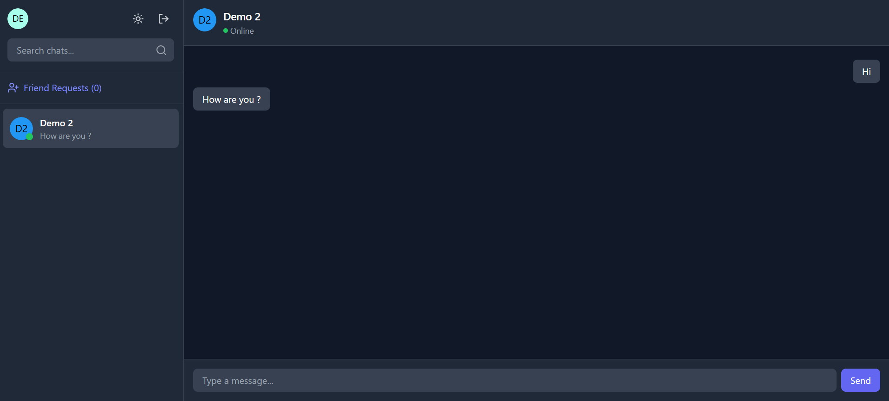

# ChatApp Turbo

This is a monorepo for the ChatApp Turbo project, built using Turborepo.

## Using this project

To get started, clone the repository and install dependencies:

```sh
git clone https://github.com/Vijay-kumar-bantu/chat-app-turbo
cd chatapp-turbo
pnpm install
```

## What's inside?

This monorepo includes the following packages/apps:

### Apps and Packages

- `Frontend`: a [React.js](https://reactjs.org/) app for the chat interface
- `backend`: a Node & express js server
- `@chatapp/ui`: a shared React component library used by both `Frontend` application
- `@chatapp/eslint-config`: `eslint` configurations (includes `eslint-config-next` and `eslint-config-prettier`)
- `@chatapp/typescript-config`: `tsconfig.json`s used throughout the monorepo
- `@chatapp/utils`: useful functions through out the monorepo

Each package/app is 100% [TypeScript](https://www.typescriptlang.org/).

### Utilities

This monorepo has the following tools pre-configured:

- [TypeScript](https://www.typescriptlang.org/) for static type checking
- [ESLint](https://eslint.org/) for code linting
- [Prettier](https://prettier.io) for code formatting

### Build

To build all apps and packages, run the following command:

```sh
pnpm build
```

### Develop

To develop all apps and packages, run the following command:

```sh
pnpm dev
```

### Docker Setup

To run the application using Docker, ensure you have Docker and Docker Compose installed on your system. Then, follow these steps:

1. Build the Docker images and start the containers:

   ```sh
   docker-compose up --build
   ```

2. The application will be available at the respective ports defined in the `docker-compose.yml` file.

3. To stop the containers, use:

   ```sh
   docker-compose down
   ```

Make sure to check the `docker-compose.yml` file for configuration details.

### Screenshots

Here are some screenshots of the application:

#### Landing Page


#### Chat Interface



## Author

**Vijay Kumar Bantu**  
Email: [capvijju24@gmail.com](mailto:capvijju24@gmail.com)
